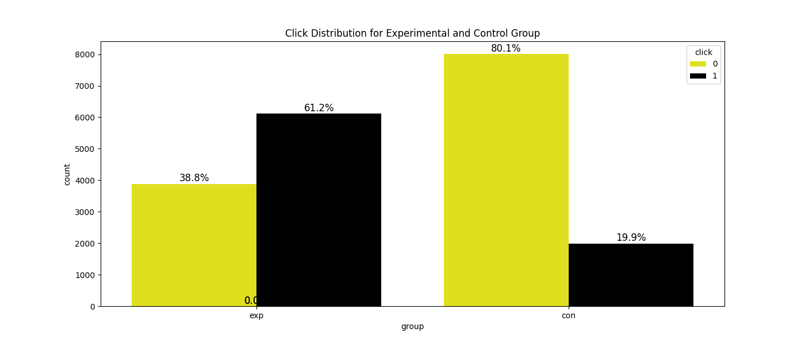
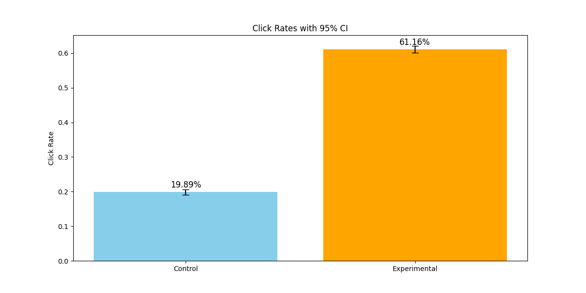
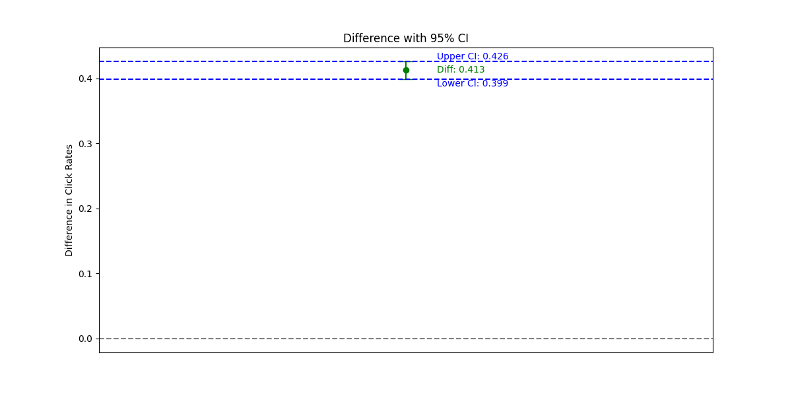
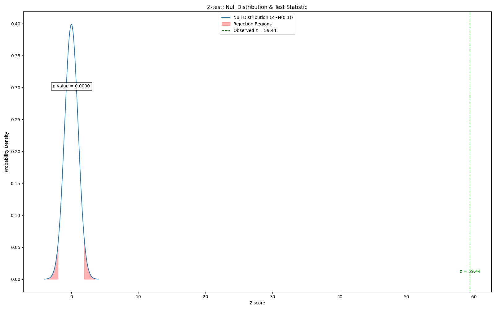
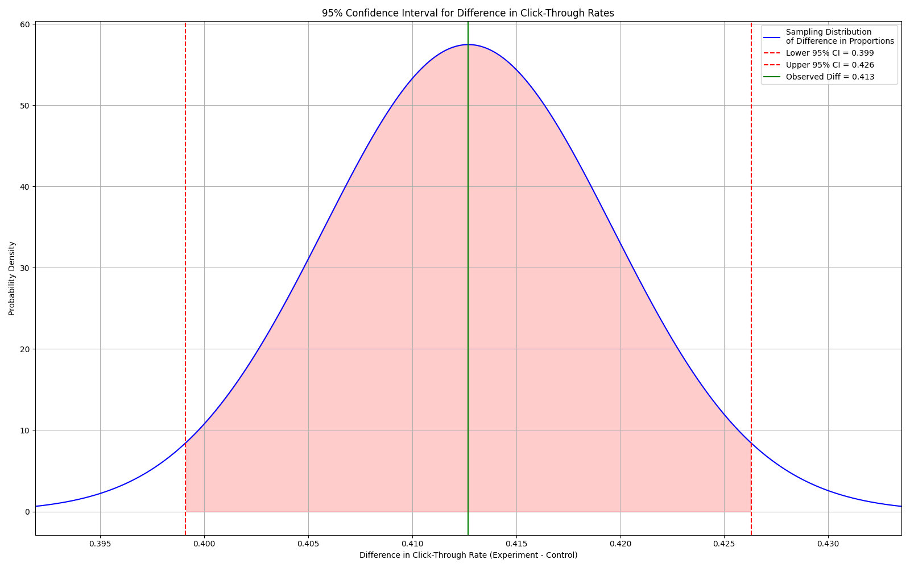

# A/B Test Click-Through Rate Analysis

This project analyzes an A/B test comparing click-through rates (CTR) between a control group and an experimental group. It applies statistical hypothesis testing and visualization to evaluate both statistical and practical significance.

---

## Project Overview

- **Objective:** Determine whether the experimental group exhibits a meaningful and statistically significant increase in CTR.
- **Sample size:** 10,000 users per group
- **Metric:** Click-through rate (CTR)

---

## Statistical Analysis

- **Control Group CTR:** 19.89%
- **Experimental Group CTR:** 61.16%
- **Observed Difference:** +41.27 percentage points

A two-sample Z-test was conducted to assess whether this difference is statistically significant.

- **Z-score:** 59.44 (>> 1.96 threshold for 95% confidence)
- **P-value:** ~0 (indicating the difference is highly unlikely due to chance)

---

## Confidence Interval & Practical Significance

- **95% Confidence Interval for the difference:** [0.399, 0.426]
- **Minimum Detectable Effect (MDE):** 0.1 (10%)

Since the **entire confidence interval lies above the MDE**, we conclude that the observed effect is not only statistically significant but also **practically meaningful** for business decisions.

---

## Visualization


- This bar plots show the distribution of clicks of **Experimental** and **Control** Group.


- This bar plot displays the observed **click-through rates (CTR)** for the Control and Experiment groups. Each bar shows the point estimate of the CTR, with **vertical error bars representing the 95% confidence interval**, illustrating the uncertainty around the estimated rates.


- This plot shows the **difference in CTR between the Experiment and Control groups, along with the 95% confidence interval for this difference.** The horizontal line at zero represents the null hypothesis of no difference. **If zero is not within the confidence interval, the difference is statistically significant at the 5% level.**


- This plot visualizes the **standard normal distribution under the null hypothesis (no difference)**. The **red shaded areas indicate the rejection regions** for a two-tailed test at the **5% significance level.** The observed **z-score from the data is marked**, with the corresponding **p-value** displayed, helping to assess **statistical significance.**


- This plot shows the **estimated difference in click-through rates between the experiment and control groups with its 95% confidence interval.** The blue curve depicts the normal approximation of the difference’s sampling distribution. Red dashed lines mark the confidence interval bounds, and the green line indicates the observed difference. **This visualization highlights the uncertainty around the estimate and helps determine if the difference is statistically significant.**

---

## Tools & Technologies

- Python
- Jupyter Notebook
- NumPy
- Pandas
- SciPy (statistical computations)
- Matplotlib (visualizations)
- Seaborn (visualizations)

---

## How to Run

1. Clone this repository
2. Install dependencies (if needed):  
   ```bash
   pip install numpy pandas matplotlib seaborn

