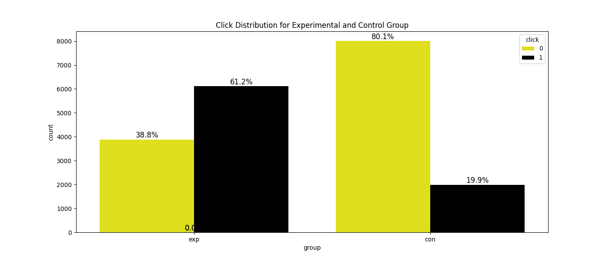

# A/B Test Click-Through Rate Analysis

This project analyzes an A/B test comparing click-through rates (CTR) between a control group and an experimental group. It applies statistical hypothesis testing and visualization to evaluate both statistical and practical significance.

---

## Project Overview

- **Objective:** Determine whether the experimental group exhibits a meaningful and statistically significant increase in CTR.
- **Sample size:** 10,000 users per group
- **Metric:** Click-through rate (CTR)

---

## Statistical Analysis

- **Control Group CTR:** 19.89%
- **Experimental Group CTR:** 61.16%
- **Observed Difference:** +41.27 percentage points

A two-sample Z-test was conducted to assess whether this difference is statistically significant.

- **Z-score:** 59.44 (>> 1.96 threshold for 95% confidence)
- **P-value:** ~0 (indicating the difference is highly unlikely due to chance)

---

## Confidence Interval & Practical Significance

- **95% Confidence Interval for the difference:** [0.399, 0.426]
- **Minimum Detectable Effect (MDE):** 0.1 (10%)

Since the **entire confidence interval lies above the MDE**, we conclude that the observed effect is not only statistically significant but also **practically meaningful** for business decisions.

---

## Visualization

The plot below illustrates the sampling distribution of the difference in CTR:

- **Green line**: Observed difference between groups
- **Red dashed lines**: 95% confidence interval boundaries
- The distribution clearly shows the effect is well above the practical significance threshold.




---

## Tools & Technologies

- Python
- Jupyter Notebook
- NumPy, SciPy (statistical computations)
- Matplotlib (visualizations)

---

## How to Run

1. Clone this repository
2. Install dependencies (if needed):  
   ```bash
   pip install numpy scipy mat

